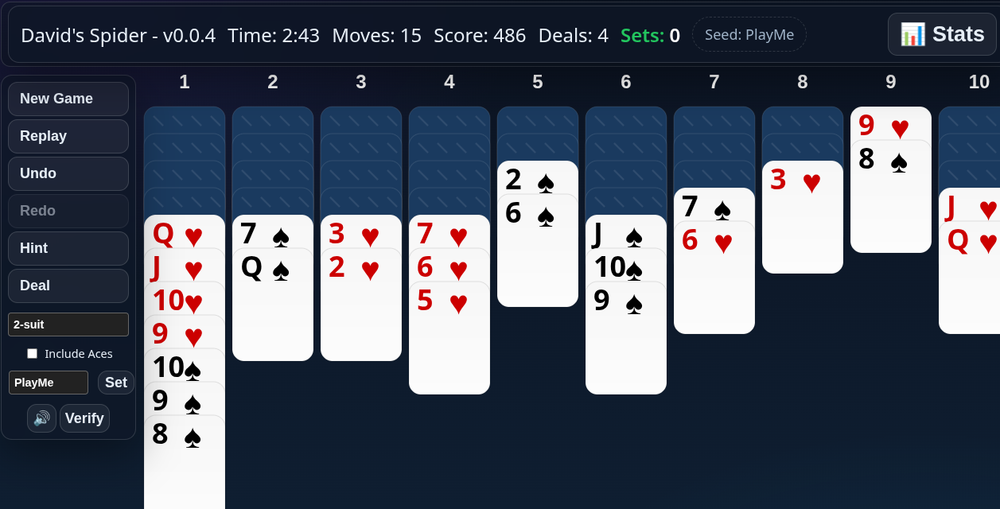

# 🕷️ Spider Solitaire

A modern, feature-rich implementation of the classic Spider Solitaire card game. Enjoy smooth gameplay, beautiful visuals, and powerful features that make this the ultimate Spider Solitaire experience!

## ✨ Features

### 🎮 Game Modes
- **3 Difficulty Levels**: Choose from 1-suit (easiest), 2-suit, or 4-suit (expert) variations
- **Custom Seeds**: Replay your favorite games or challenge friends with the same setup
- **Toggle Aces**: Toggle to not include Aces for a slightly easier challenge

### 🎨 Enhanced Gameplay
- **Smooth Animations**: Fluid card movements and transitions
- **Audio Feedback**: Satisfying sound effects for all actions
- **Visual Cues**: Clear indicators for valid moves and game status
- **Undo/Redo**: Made a mistake? No problem!

### 📊 Game Statistics
- Track your best times, scores, and moves
- View detailed game history and win/loss ratios
- Monitor your progress across different difficulty levels
- Track your current winning streak

### 🎯 Smart Features
- **Auto-save**: Never lose your progress
- **Game Recovery**: Return to interrupted games
- **Hints**: Get suggestions when you're stuck
- **Responsive Design**: Play on any device

## 🎮 How to Play

1. **Objective**: Build complete sequences from King to Ace for 8 sets
2. **Move Cards**: Drag and drop cards to build descending sequences
3. **Complete a Run**: Assemble a full sequence to remove it from play
4. **Deal New Cards**: Click the deal button when no moves are available
5. **Win**: Clear all cards from the tableau!

## 🎛️ Controls

- **New Game**: Start a fresh game
- **Undo/Redo**: (U/R keys) Step backward or forward through moves
- **Hint**: (H key) Get a hint  for a suggested move
- **Deal**: (D key) Deal a new row of cards from the stock to each tableau column
- **Mute**: Toggle sound effects

## 🚀 Quick Start

1. Open `index.html` in your web browser
2. Choose your preferred difficulty level or set a custom seed
3. Start playing!

## 📱 Play Anywhere

This version of Spider Solitaire works on all devices - desktop, tablet, or mobile. Your progress is automatically saved in your browser, so you can pick up right where you left off.

## 🔄 Open Source

Love the game? Found a bug? Want to contribute? Check out our [GitHub repository]
(https://github.com/david-slimp/Spider) to get involved!

---

*Enjoy the game! For any questions or feedback, please open an issue in the GitHub repository.*
